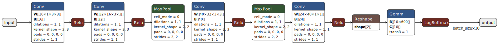
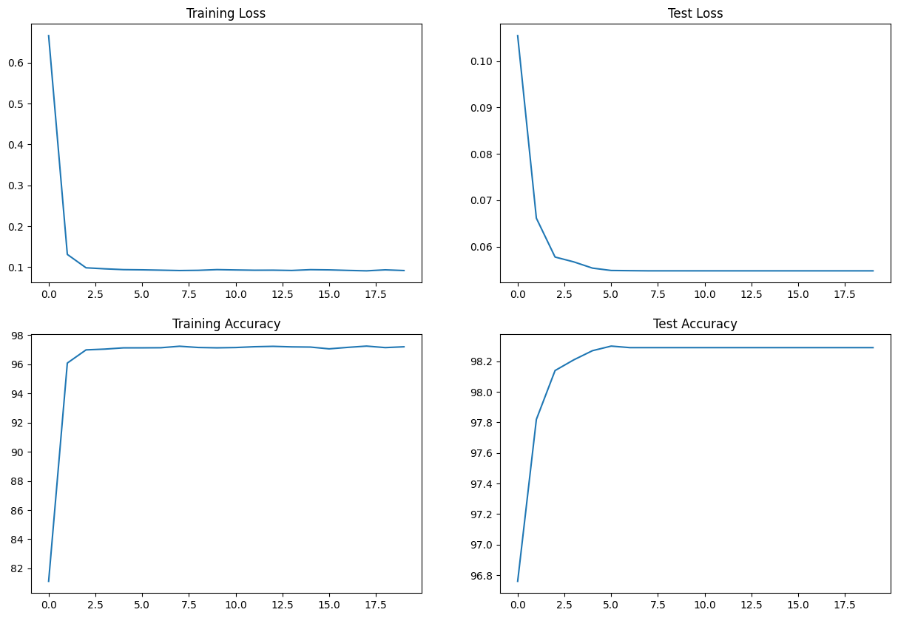

# 🧠 CNN Classifier for MNIST Handwritten Digits

This project implements a **compact Convolutional Neural Network (CNN)** with approximately **25,000 parameters**, designed and trained on the **MNIST** dataset using **PyTorch**.

---

## 📚 1. About the MNIST Dataset

**MNIST** (Modified National Institute of Standards and Technology) is a widely used dataset for benchmarking image classification models.

- **Images:** 70,000 grayscale images of handwritten digits (0–9)
- **Size:** 28x28 pixels
- **Split:**
  - 60,000 training images
  - 10,000 test images
- **Classes:** 10 (digits 0 through 9)

---

## ⚖️ 2. Why Normalize the Data?

Normalization rescales the pixel intensity values to help the network train more effectively.

### 🔢 Typical normalization for MNIST:
```python
transforms.Normalize((0.1307,), (0.3081,))
```
✅ **Benefits:**
- Speeds up convergence
- Prevents vanishing/exploding gradients
- Stabilizes learning across layers

---

## 🧪 3. Data Augmentation

While MNIST is relatively clean, data augmentation helps improve generalization, especially for compact networks.

**Techniques Used:**
```python
transforms.Compose([
    transforms.RandomRotation(10),
    transforms.RandomAffine(degrees=0, translate=(0.1, 0.1)),
    transforms.ToTensor(),
    transforms.Normalize((0.1307,), (0.3081,))
])
```
✅ **Advantages:**
- Reduces overfitting
- Improves robustness to real-world variations in handwriting
- Simulates rotation, translation, and distortion

---

## 🧠 4. CNN Architecture & Parameters

✅ **Layer-wise Summary**



📊 **Parameter Breakdown**

| Layer | Description                  | Parameters |
|-------|------------------------------|------------|
| Conv1 | 1 input → 16 filters (3x3)   | 160       |
| Conv2 | 16 → 32 filters (3x3)        | 4,640     |
| Conv3 | 32 → 40 filters (3x3)        | 11,600    |
| Conv4 | 40 → 24 filters (1x1)        | 984       |
| FC1   | Fully connected (600 → 10)   | 6,010     |
| **Total** |                          | **23,394** ✅ |

---

## 📈 5. Optimizer Observations

Both SGD and Adam were tested for training the model.

| Optimizer | Convergence Speed | Final Accuracy (MNIST) | Comments                  |
|-----------|-------------------|------------------------|---------------------------|
| SGD      | Slower            | ~96%                   | Needs careful LR tuning  |
| Adam     | Faster            | ~98%                   | Recommended for quick convergence |

💡 **Insight:**  
Adam adapts learning rates per parameter using moment estimates, making it significantly faster than vanilla SGD, especially for smaller models.

### 🧪 Training Configuration

| Parameter       | Value     |
|-----------------|-----------|
| Batch Size      | 512        |
| Epochs          | 20         |
| Loss Function   | nn.NLLLoss() |
| Activation      | ReLU      |
| Final Activation| log_softmax |
| Optimizer       | Adam      |

---

## 🧾 Requirements

```bash
pip install torch torchvision matplotlib
```

---


## 🎯 Future Work

- Add Dropout for regularization
- Use BatchNorm to stabilize training
- Explore deeper variants with similar param budgets
- Test on Fashion-MNIST or CIFAR-10

---

## 📌 Final Notes

✅ Compact architecture with ~23K parameters  
✅ Achieves ~98% test accuracy on MNIST with Adam  

✅ Designed for learning, experimentation, and speed  

---

## 📎 License

MIT License

---

## ✍️ Author

Your Name — [@yourgithub](https://github.com/yourgithub)